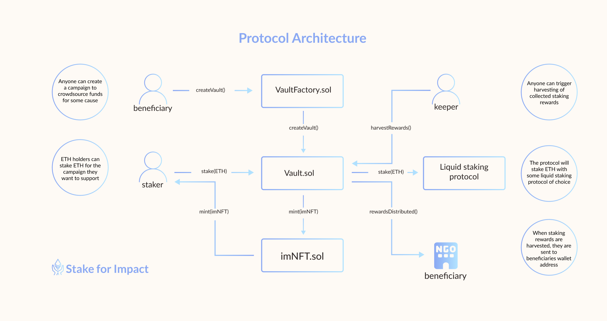

# What is Stake for Impact?

It's a permissionless protocol that connects fundraisers in seek of crowdfunding with donors who have an opportunity to support financially the cause they care about with yield earned from their crypto assets.

The protocol is build with transparency and simplicity in mind. It is considered to be a public good that is available for anyone to use. Therefore, the protocol is free to use, completely permisionless (anyone can create campaigns) and governance free.

<figure><figcaption></figcaption></figure>

Someone can create a campaign by simply providing beneficiary Ethereum compatible wallet address.

Current version of the protocol allows people to support the campaigns they care about by depositing ETH to the respective vault. In return, stakers receive an NFT representing their stake in the protocol.&#x20;

Deposited ETH will be staked with one of liquid staking providers (Lido, Rocket Pool, FraxETH, etc.)

The staking rewards from all user's deposits in the vault will be transferred to beneficary's wallet address.

The principal (donor's stake in the protocol) can be withdraw at anytime.

